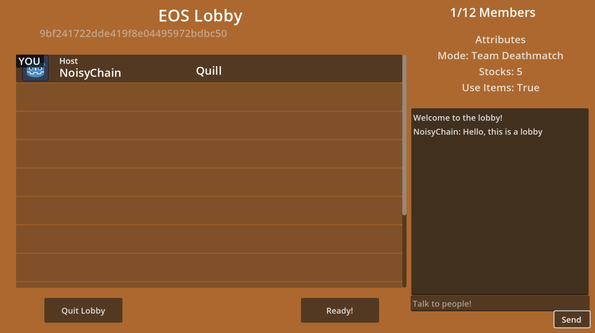

# godot-eos-csharp-lobby

A Lobby system made for Godot 4 using EOS C# SDK

## Why did you make this?
Glad you asked!
My main goal with this is just to be a personal challenge of mine. Even with a bunch of addons for Gdoot that do the same thing, I think it's pretty cool to be able to make the C# version of the SDK work flawlessly with Godot.

Another reason is because the addons out there, like most GDExtension projects, are more worried about making it work with GDScript. This one, on the other hand, is made especially for C#, since C# is my main language.

## Getting started
1. Download or clone this repository
2. Download the EOS C# SDK if necessary (it shouldn't be)
3. Create a product in the [Epic Games Developer Portal](https://dev.epicgames.com/portal) (you need to create an Epic Games account)
4. Add the EOSManager.cs autoload script in your autoload list if necessary (only necessary if you're adding the files to another project)
5. Copy all the product information to the EOSManager.cs script (you will know where)
6. You should be ready to go

## Included features
- Authentication with Epic Games account
- Annonymous connection with Device ID
- Lobby (Create lobby, Join lobby by ID, Search for lobbies, Lobby and Lobby member attributes)
- Crossplay
- P2P chat
### Coming someday
- Connect with Steam (needs Steam App ID)
- Kick from lobby (I forgot this one, sorry)

## Build for Android
1. [Setup a Gradle build for your Godot project](https://docs.godotengine.org/en/stable/tutorials/export/android_gradle_build.html)
2. Extract the content from the *android build.zip* file
3. Replace the files in the "android" folder by the ones from the ZIP file
4. Follow the steps [from the EOS Godot page](https://github.com/3ddelano/epic-online-services-godot?tab=readme-ov-file#exporting-for-android) (from step 7)
5. On *android/build/build.gradle*, at line 133, add your EOS project's client ID;

